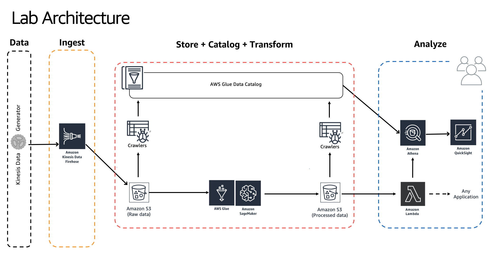

# Building Serverless Data Lakes on AWS

Author: Unni Pillai | Amazon Web Services | [Twitter](https://twitter.com/unni_k_pillai) | [Linkedin](http://bit.ly/upillai)

Updated by: Vikas Omer | Amazon Web Services | [Linkedin](https://www.linkedin.com/in/vikas-omer/)

### Learning outcomes from this workshop?
* Design serverless data lake architecture
* Build a data processing pipeline and Data Lake using Amazon S3 for storing data
* Use Amazon Kinesis for real-time streaming data
* Use AWS Glue to automatically catalog datasets
* Run interactive ETL scripts in an Amazon SageMaker Jupyter notebook connected to an AWS Glue development endpoint
* Query data using Amazon Athena & visualize it using Amazon QuickSight

# Pre-requisites:  
* You need to have access to an AWS account with **AdminstratorAccess**
* This lab should be executed in **us-west-2** region
* Best is to **follow links from this  guide** & open them **in new a tab**
* Run this lab in a modern browser

# Modules

**Module** | **Link**
--- | ---
Ingest and Store | [link](./modules/ingest.md)
Catalog Data | [link](./modules/catalog.md)
Transform Data with AWS Glue | [link](./modules/transform_glue.md)
Analyze with Athena | [link](./modules/analyze.md)
Visualize with Quicksight | [link](./modules/visualize.md)
Lambda | [link](./modules/lambda.md)
Cleanup | [link](./modules/cleanup.md)

Please do check on the pre-requisites for each module before starting the activities within the module.

Also, do not forget to clean up the resources at the end of the workshop!

### Build on!

